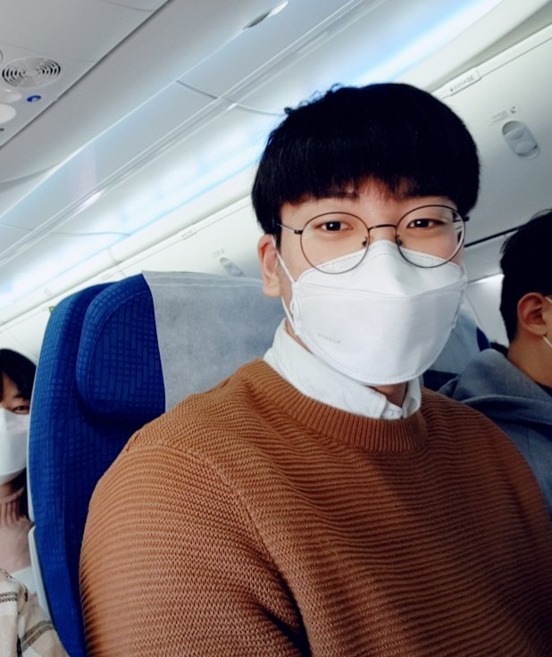

{: style="float: right; width: 175px; height: 225px; margin-right: 1em; margin-top: 0.5em "}

### About me
I am currently working at NAVERLABS, Korea. I achieved Master at [VILAB](http://vi.kaist.ac.kr/), Korea Advanced Institute of Science and Technology(KAIST) and Baschelor's degree at Pohang University of Science and Technology(POSTECH). My advisor was Prof. [Kuk-Jin Yoon](https://scholar.google.ca/citations?user=1NvBj_gAAAAJ&hl=en), whom I respect. Please contact me if you need through e-mail, jseob.y@naverlabs.com.

**Curriculum Vitae** : It will be updated soon \
**LinkedIn** : [link](https://www.linkedin.com/in/%EC%A2%85%EC%84%AD-%EC%9C%A4-5b4193260/) \
**Personal Blog (Korean)** : [link](https://jseobyun.tistory.com) 

 

### Research Interest
Focused on computer vision and computer graphics that handle human stuffs(face, body pose/shape) and 3D geometric tasks (SfM, MVS, surface reconstruction, neural rendering).\

### Expertise

**1)** Camera intrinsic/extrinsic calibration(both pinhole, fisheye) and Image warping\
**2)** Optimization based on [CERES](https://github.com/ceres-solver/ceres-solver) (e.g. 6DOF pose estimation)\
**3)** Neural rendering / surface reconstruction \
**4)** 2D/3D Human pose and shape estimation\
**5)** Omnidirectional image handling \
**6)** Structure from motion and Multiview Stereo, Feature matching 

 

### Publications (Conference)
<!--SpherePHD-->

<b> SpherePHD: Applying CNNs on a Spherical PolyHeDron Representation of 360◦ Images
 </b>
 
Yeonkun Lee*, Jaeseok Jeong∗, <b>Jongseob Yun∗</b>, Wonjune Cho∗, Kuk-Jin Yoon
 
<b>published in CVPR2019, co-1st author</b>
 
[<a href="https://openaccess.thecvf.com/content_CVPR_2019/papers/Lee_SpherePHD_Applying_CNNs_on_a_Spherical_PolyHeDron_Representation_of_360deg_CVPR_2019_paper.pdf">PAPER</a>]

 
 
 

### Publications (Journal)
<!--SpherePHD TPAMI-->

<b> SpherePHD: Applying CNNs on 360∘∘ Images With Non-Euclidean Spherical PolyHeDron Representation
 </b>
 
Yeonkun Lee*, Jaeseok Jeong∗, <b>Jongseob Yun∗</b>, Wonjune Cho∗, Kuk-Jin Yoon
 
<b>published in  IEEE Transactions on Pattern Analysis and Machine Intelligence (TPAMI 2020), co-2nd author</b>
 
[<a href="https://ieeexplore.ieee.org/document/9099466">PAPER</a>]

 
 
 

### Projects (Non-confidential only)
<!--2D human-->

<b> SpherePHD: Applying CNNs on 360∘ Images With Non-Euclidean Spherical PolyHeDron Representation
 </b>
 
Yeonkun Lee*, Jaeseok Jeong∗, <b>Jongseob Yun∗</b>, Wonjune Cho∗, Kuk-Jin Yoon
 
<b>published in  IEEE Transactions on Pattern Analysis and Machine Intelligence (TPAMI 2020), co-2nd author</b>
 

 
 
 