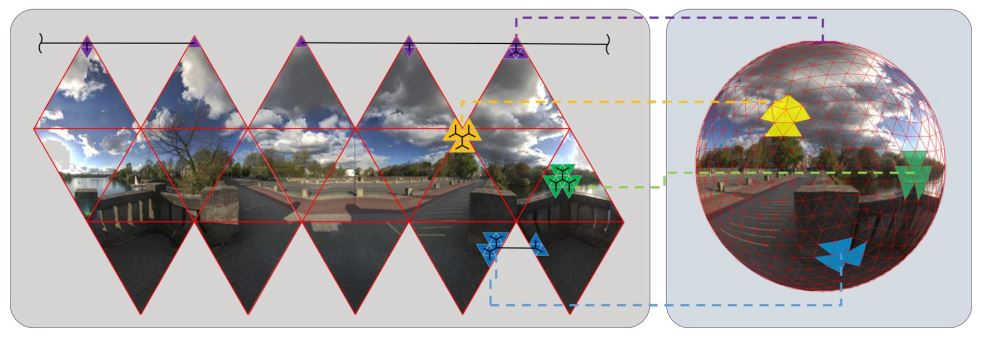
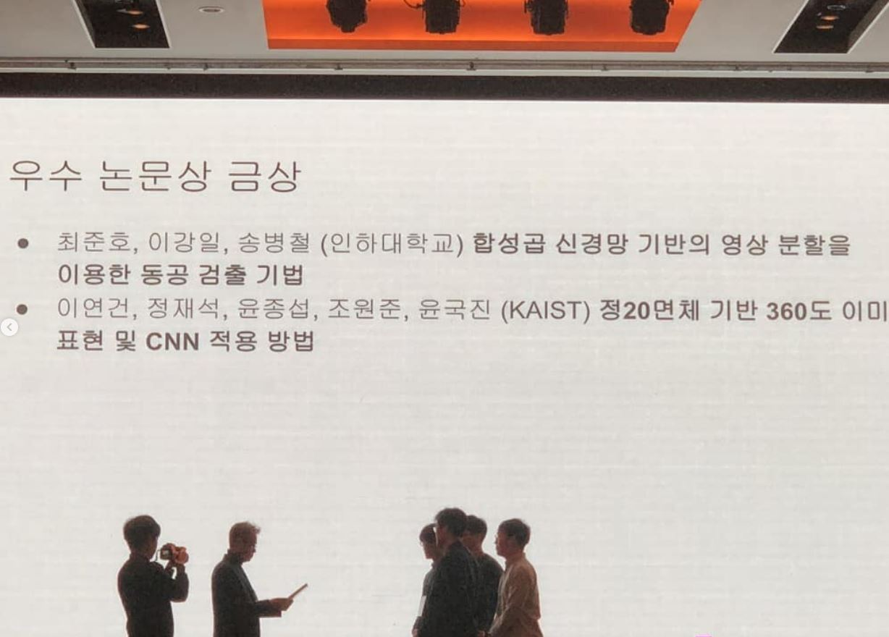

{: style="float: right; width: 200px; height: 200px; margin-right: 1em; margin-top: 0.5em "}

### About me
Hello, I'm Jongseob Yun. Thanks to visit this page! I've focused on computer vision and computer graphics that handle human stuffs(face, body pose/shape) and 3D geometric tasks (SfM, MVS, surface reconstruction, neural rendering). I am currently working at NAVERLABS, Korea. Please contact me if you need through e-mail!

**Curriculum Vitae** : [link](./docs/Simple_short_CV___2023_01_01_.pdf) \
**LinkedIn** : [link](https://www.linkedin.com/in/%EC%A2%85%EC%84%AD-%EC%9C%A4-5b4193260/) \
**Blog (Korean only)** : [link](https://jseobyun.tistory.com) \
**Contact** :  jseob.y@naverlabs.com
 

### Education
**1)** Ph.D. Candidate in [VILAB](http://vi.kaist.ac.kr/) advised by Prof. [Kuk-Jin Yoon](https://scholar.google.ca/citations?user=1NvBj_gAAAAJ&hl=en), Korea Advanced Institute of Science and Technology(KAIST) from 2024 ~ . \
**2)** Master degree from [VILAB](http://vi.kaist.ac.kr/) advised by Prof. [Kuk-Jin Yoon](https://scholar.google.ca/citations?user=1NvBj_gAAAAJ&hl=en), Korea Advanced Institute of Science and Technology(KAIST) \
**3)** Baschelor's degree at Pohang University of Science and Technology(POSTECH)
 

### Expertise

**1)** Camera intrinsic/extrinsic calibration(both pinhole, fisheye) and Image warping \
**2)** Optimization based on [CERES](https://github.com/ceres-solver/ceres-solver) (e.g. 6DOF pose estimation) \
**3)** Neural rendering / surface reconstruction \
**4)** 2D/3D Human pose and shape estimation\
**5)** Omnidirectional image handling \
**6)** Structure from motion and Multiview Stereo, Feature matching 

 

### Skills
**1)** Python (numpy, torch, opencv, etc.)    👍👍👍👍👍 \
**2)** C++ (boost, tbb, opencv, ceres, etc.)  👍👍👍 \
**3)** Docker/Git/Linux                       👍👍👍 \
**4)** Calibration tools (camodocal, basalt)  👍👍👍

 

### Publication (Conference)
<!--SpherePHD-->

 

<b> SpherePHD: Applying CNNs on a Spherical PolyHeDron Representation of 360◦ Images
 </b>
 
Yeonkun Lee*, Jaeseok Jeong∗, <b>Jongseob Yun∗</b>, Wonjune Cho∗, Kuk-Jin Yoon
 
<b>published in CVPR2019, co-1st author</b>
 
[<a href="https://openaccess.thecvf.com/content_CVPR_2019/papers/Lee_SpherePHD_Applying_CNNs_on_a_Spherical_PolyHeDron_Representation_of_360deg_CVPR_2019_paper.pdf">PAPER</a>]

 

### Publication (Journal)
<!--SpherePHD TPAMI-->

<b> SpherePHD: Applying CNNs on 360∘∘ Images With Non-Euclidean Spherical PolyHeDron Representation
 </b>
 
Yeonkun Lee*, Jaeseok Jeong∗, <b>Jongseob Yun∗</b>, Wonjune Cho∗, Kuk-Jin Yoon
 
<b>published in  IEEE Transactions on Pattern Analysis and Machine Intelligence (TPAMI 2020), co-2nd author</b>
 
[<a href="https://ieeexplore.ieee.org/document/9099466">PAPER</a>]

 

### Experience
<!--2D human-->

<b> Reproducing and Extending OpenPIFPAF
 </b>
 
 
I reproduced 2D HPE algorithm, OpenPIFPAF and extended it by adding bounding box module and absolute human distance module. 
 
 
 
 
 

<!--3D human anoot-->

<b> Making 3D human pose annotation tools
 </b>
 
 
I made 3D human annotaion tool(GUI) based on epipolar geometry. 
 
 
 
 
 

<!--3D human fit-->

<b> Fitting SMPL to RGBD images
 </b>
 
 
I made optimization based SMPL fitting algorithm on RGBD images. The pipeline follows SMPLify and VideoAvatar.
 
 
 
 
 

<!--2D motion synthesis-->

<b> Rerpoducing EverybodyDanceNow (2D motion synthesis) for fun
 </b>
 
 
For practicing GAN framework, I reproduced EverybodyDanceNow pytorch ver. based on arxiv paper.
 
 
 
 
 

<!--obj classic-->

<b> Reproducing KinectFusion and VisualHull
 </b>
 
 
I reproduced KinectFusion and VisualHull pytorch GPU ver. 
 
 
 
 
 

<!--obj neural-->

<b> Following up 3D neural surface reconstruction SOTAs
 </b>
 
 
I've followed up NeRF series that focusing on reconstructing surfaces. Additionally, I invented the method to fill out unscanned region of rigid objects.
 
 
 
 
 

<!--obj neural-->

<b> Various camera model reproduction and calibration
 </b>
 
 
I've covered various camera model(BC, KB, UCM, DS, etc.) and reproduced them using numpy and pytorch, so I'm familiar with undistortion and warping among camera models. Additionally I've implemented extrinsic calibration pipepline based on CERES by myself.
 
 
 
 
 
 

### Career
<!--polygom-->

<b> POLYGOM, KOREA (2024.04 ~ now)
 </b>
 
 
I am currently working at POLYGOM, start-up that handling 3D digital humans. Specifically, face reconstruction is main point. 
 
 
 
 
 

<!--naverlabs-->

<b> NAVERLABS, KOREA (2020.12 ~ 2024.03)
 </b>
 
 
I worked at Robot vision team in Vision group as <b>Technical Research Personnemilitary</b> which is one kind of military service for 3 years. 
 
 
 
 
 

<!--keti-->

<b> KETI, Pangyo (2020.8 ~ 2020.12)
 </b>
 
 
I shortly worked human team as an internship. 
 
 
 
 
 

<!--KAIST-->

<b> KAIST, Daejeon (2018.8 ~ 2020.8)
 </b>
 
 
I graduated VILAB advised by Kuk-Jin Yoon after finishing Master degree course.
 
 
 
 
 

<!--POSTECH-->

<b> POSTECH, Pohang (2013.3 ~ 2018.8)
 </b>
 
 
I graduated Mechnical enginerring department with 1 year leave of absence. During the leave of absence, I worked at start-up company that developed Robot control system.
 
 
 
 
 

### Honor
<!--ipiu-->

<b> The 31st Image Processing and Image Understanding(IPIU) Best paper award Winner
 </b>
 
Our paper mentioned as Best paper of the 31st Image Processing and Image Understanding(IPIU)
 
 
 
 
 

<!--scholarship-->

<b> On Dream Future Industry Graduate School Scholarship
 </b>
 
I was selected the student of On Dream Future Industry Graduate School Scholarship 2019-2020
 
 
 
 
 

 

### Personal Things

<b> Basketball Team, POBBA (POSTECH)
 </b>
 
I've been basketball team member since 2014 and still enjoyed games with our sernios and juniors. Additionally I've done steadily workout for 8 years.
 
 
 
 
 

